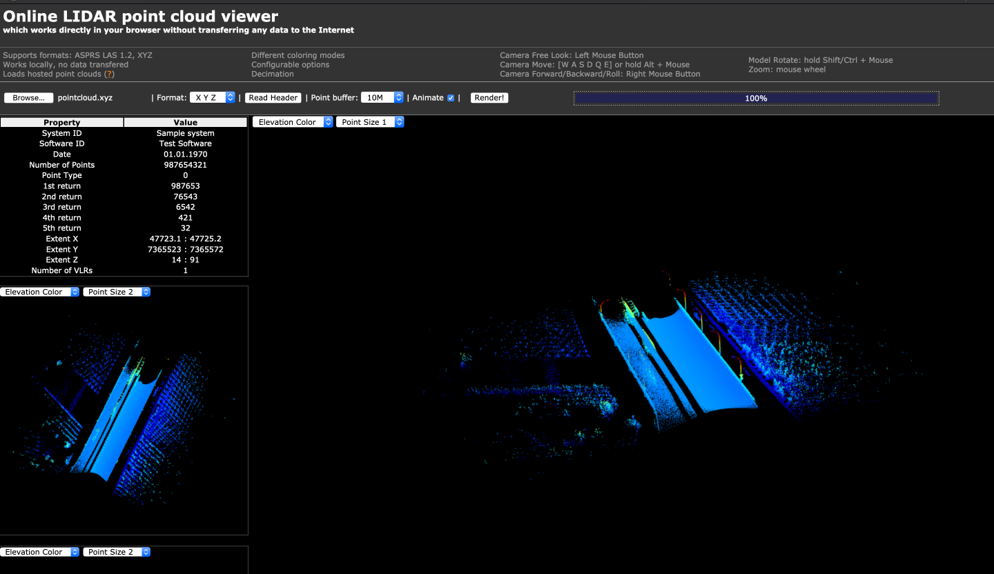
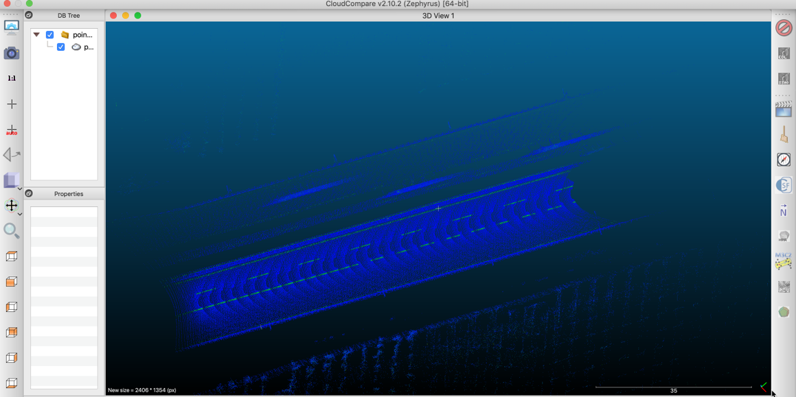
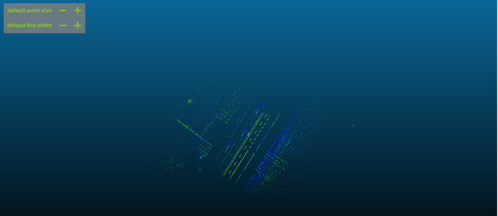
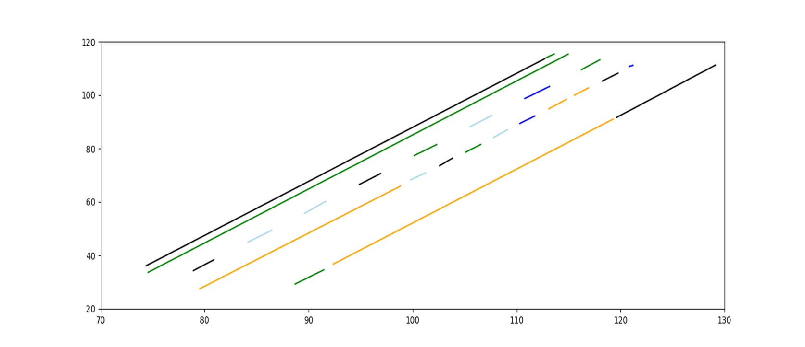
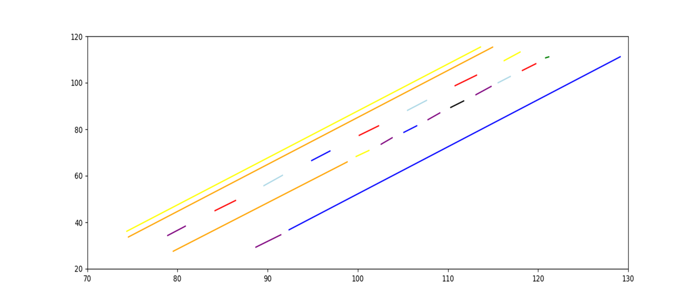
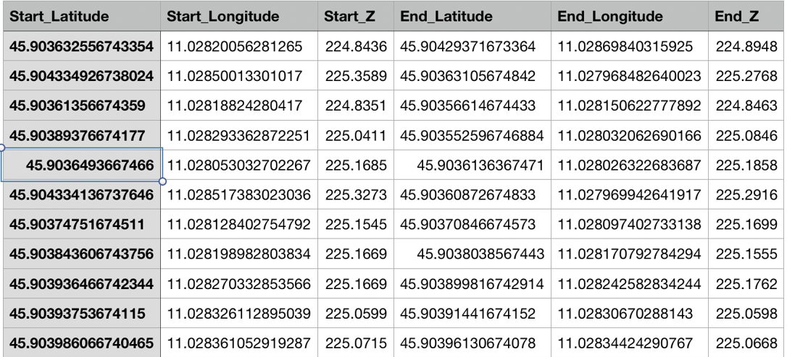

# Object detection in Point Cloud: Lane Marking

<p align="center">
  <a style="text-decoration:none">
    
  </a>
</p>

<p align="center">
   <a style="text-decoration:none" href="https://www.linkedin.com/in/chirag-khandhar">
    
  </a>
  <a style="text-decoration:none" href="https://www.linkedin.com/in/akshaykulkarni1995/">
    
  </a>
  <a style="text-decoration:none" href="https://www.linkedin.com/in/meghatatti/">
    
  </a>
</p>

The goal of the project is detecting the lane marking for a small LIDAR point cloud. 
We've built a system that is able to identify the lane marking by analyzing the intensity value within a point cloud.

The project is divided into 4 parts as follows: 

## 1. Visualization of Point Cloud:


* The given LIDAR point cloud has latitude and longitude information and needs to be converted to the Cartesian system.
* We used the latitude and longitude info to calculate UTM coordinates for each point.
* Hence, we got values for Easting(X) and Northing(Y)
* The altitude value is reflected as the Z coordinate in our new coordinate system.
* So now  to visualize our newly calculated data we used http://lidarview.com



* The idea to recover the lane marking from a flat surface is to extract it’s intensity.
* Because the lane markings have a higher intensity compared to the plain asphalt or concrete of the street.
* However, the tool we used did not work very well, because it uses different colors to denote different levels of elevation. 
* Thus, to solve this problem we used [Cloud Compare Viewer](https://asmaloney.com/software/) that uses different colors to denote different levels of intensity.



## 2. Filtering of Point cloud :

* The idea is to remove all the noise from the data, i.e. to remove all those points that have extreme intensities (too high/too low).
* As, different lighting conditions (day-night) might affect the intensity values, we thus calculated the mean and standard deviation intensity for all points.
* So our assumption is intensity of lane marking is greater than mean of all points. 
* Also, we could have also set an adaptive threshold per point cloud slice. However, since there was no slice information left we had to use this approach. 




* So we can see that we have significantly removed a lot of noise, however there are a lot of points of the road.
* To reduce this, we used the actual trajectory information by removing points that are too far away from the actual trajectory line.
* We used a threshold value of 20m which reduced the number of points from 32191 to 18496.
* The results can be seen clearly in the next slide.


## 3. Detection of Lane Marking  :

* So after filtering our pointcloud with Trajectory and Mean value  filter, we can see the lane markings to a very well extent.
* However, the markings on the opposite side of the lane is also visible.
* So, in order to get rid of this problem, we used clustering using DBSCAN algorithm.
* This algorithm allows us to specify a number of points required to form a cluster and the distance separating them.
* Thus, we formed clusters of **40** points and the **eps = 0.05**
* Hence, **4073** more points we discarded leaving back **14423** points. 


The results from the clustering are quite impressive and we need to extract actual line segments out of it.

* To do so, we took 2 points that are furthest apart from each cluster (the starting and the end point)
* These two points serve as the starting and end point for a line segment. 
* These line segments can easily be visualized using matplotlib.
* Also, we fused some of the lines that are quite close to each other.
* This allows us to increase the line length of some segments. 


<p align="center">
  Before Fusing
</p>



<p align="center">
  After Fusing
</p>

## 4. Results :

* The final step it to convert the UTM coordinates back to latitude and longitude coordinates.
* Also, we’d shifted all the coordinates closer to the centre of the coordinate system which also need to be shifted back before the conversion.
* Finally, the output is exported to a .csv file.



## Conclusion & Future Work

* We’ve extracted the lane markings out of a given point cloud.
* However, our current algorithm assumes that the LIDAR data only represents a short segment of 20-30m. 
* Thus this approach is not able to detect lanes that have a curvature.
* We could solve this problem by picking a second or third degree polynomial regression algorithm.
* This would give our algorithm enough freedom to pick straight lane as well as those with a curvature.

## How to Run:

Step 1: Run ```PointCloudVisualization.py```

Step 2: Run ```PointCloudFiltering.py```  
 
Step 3: Run ```PointCloudLaneMarking.py```  


